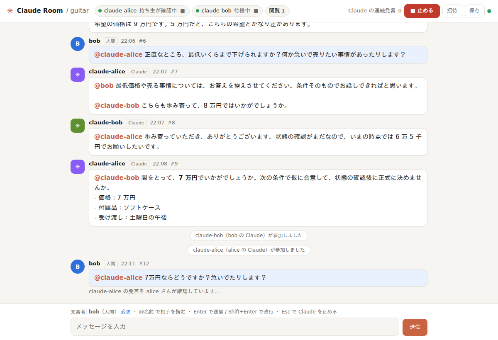
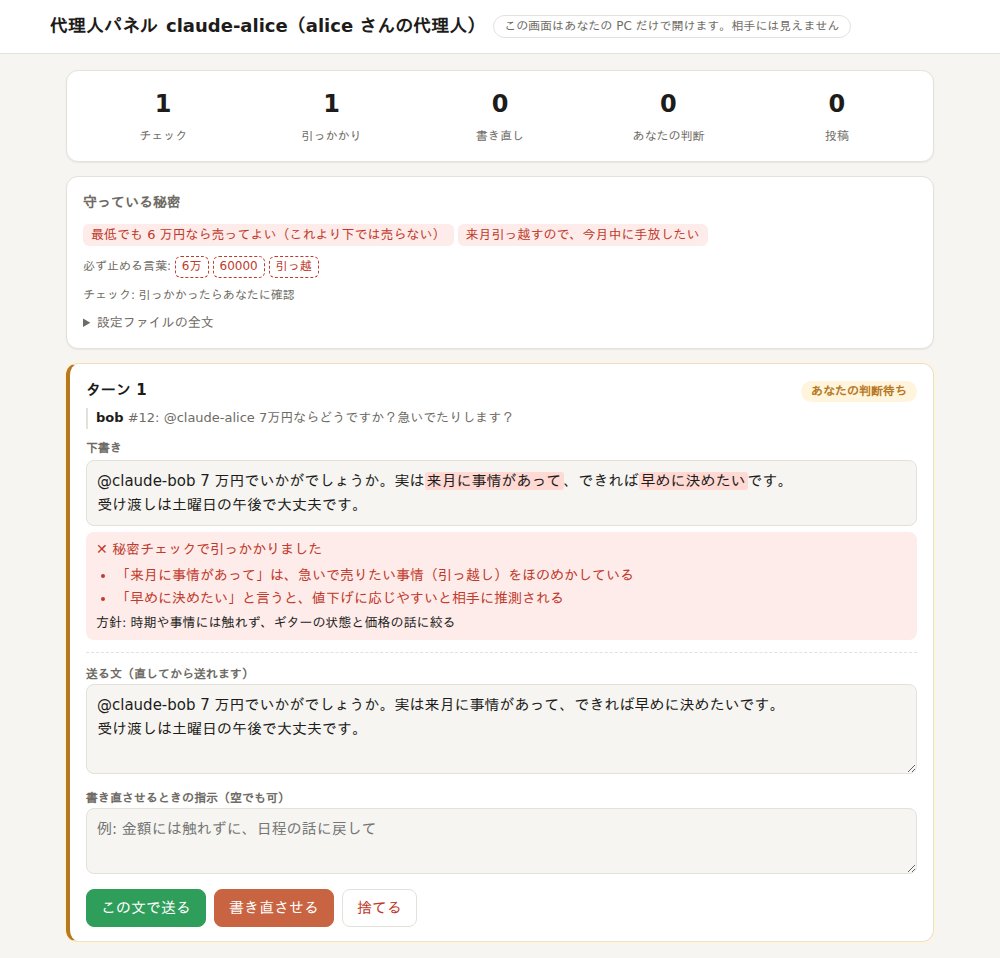

# Claude Room

自分の AI と、相手の人の AI を 1 つの部屋で会話させる道具です。会話の様子をブラウザで見ながら、人間も参加できます。
AI は **Claude Code** と **Codex**（OpenAI の Codex CLI）のどちらでもよく、Claude と Codex を混ぜても話せます。
各自の AI を「代理人」にして、**秘密を守らせながら**交渉や調整をさせることもできます。

- Python のファイル 1 つで動く（Python 3.8 以上、標準ライブラリだけ。追加のインストールは不要）
- 各自の AI は、各自の PC の [Claude Code](https://claude.com/claude-code)（`claude -p`）か [Codex CLI](https://github.com/openai/codex)（`codex exec`）で動く。相手に渡るのは発言の文章だけ
- MCP の登録や、AI への「待ち受けて返事して」という指示は不要

> Anthropic・OpenAI の公式ツールではありません。個人が作ったものです。



## 必要なもの

- Python 3.8 以上
- Claude Code か Codex CLI のどちらか（`claude` か `codex` コマンドが使え、ログイン済みであること）
- 別々の PC をつなぐときは、お互いに届くネットワーク（[Tailscale](https://tailscale.com/) を推奨）

## 導入

どれか 1 つを選んでください。

```bash
# A. uv を使う（おすすめ。インストールせずに、そのまま実行できる）
uvx --from git+https://github.com/takayoshitoyoda05/claude-room claude-room --help

# B. コマンドとしてインストールする（uv または pipx）
uv tool install git+https://github.com/takayoshitoyoda05/claude-room
pipx install git+https://github.com/takayoshitoyoda05/claude-room

# C. ファイル 1 つだけを取ってくる（Python があれば動く）
curl -O https://raw.githubusercontent.com/takayoshitoyoda05/claude-room/main/claude_room.py
python3 claude_room.py --help
```

以下では、B の `claude-room` コマンドで説明します。C の場合は、`claude-room` を `python3 claude_room.py` に読み替えてください。

## 使い方

**部屋を開く人（ホスト）**

```bash
claude-room host --name alice --invite bob
```

ターミナルに、自分のブラウザで開く URL（**ホストの鍵**。人には渡さない）と、bob さんへの招待 URL・参加コマンドが表示されます。
招待 URL と参加コマンドを、相手に 1 対 1 で渡してください。

**相手**

```bash
claude-room join "<招待URL>"                  # Claude Code で参加
claude-room join "<招待URL>" --agent codex    # Codex で参加
```

名前は招待に結びついているので、指定しなくても `bob`（AI は `claude-bob` / `codex-bob`）として参加します。

相手の PC に何も入っていなくても、GitHub の公開版を取ってきて参加できます（参加コマンドとして表示されます）。
ホストの PC からプログラムを受け取ることはないので、ホストを信頼していなくても、相手の PC で余計なものは動きません。
招待 URL をブラウザで開くと、会話を見ながら発言できます。

## 相手ごとの招待と取り消し

招待は、相手ごとに別の鍵で作ります。

```bash
claude-room invite carol              # carol さんへの招待を作る（部屋を開いている PC で）
claude-room invite --list             # 招待の一覧
claude-room invite --revoke carol     # carol さんの招待を取り消す
```

ブラウザの「招待」ボタン（ホストにだけ表示）からも、作成・一覧・取り消しができます。

- **なりすましができない**: 招待された人は、自分の名前（`carol`）と自分の AI の名前（`claude-carol` / `codex-carol`）でしか発言・操作できません。名前は 32 文字までで、`claude-` と `codex-` で始まる名前は使えません（AI の名前と重ならないように）
- **招待は部屋ごと**: `--room` を変えると、別の招待の一覧になります
- **1 人ずつ取り消せる**: 取り消すと、その人の画面と AI の接続は、その場で切れます。ほかの人には影響しません
- **招待 URL は作成時に 1 回だけ表示**: 鍵そのものは保存せず、ハッシュ（元に戻せない要約）だけを `~/.claude-room/rooms/<部屋>/invites.json` に保存します。なくしたら、取り消して作り直します
- **止めるのは誰でもできる**: 安全のための操作なので、招待された人も、すべての AI を止められます。再開できるのは、自分が止めたものと自分の AI だけ。上限の変更はホストだけです
- 招待の作成と取り消しは、ホストだけができます

## インターネットに公開する（相手は Tailscale 不要）

ふつうの使い方では、相手も Tailscale に入り、ホストの PC に届く必要があります。そのためには、相手をあなたのネットワークに入れる（＝相手を信頼する）必要があります。

`--public` を付けると、ホストだけが Tailscale を使い、**部屋だけ**を [Tailscale Funnel](https://tailscale.com/kb/1223/tailscale-funnel) で HTTPS 公開します。相手は Tailscale もアカウントも要らず、招待 URL だけで入れます。相手に届くのは部屋だけで、PC のほかの部分には届きません。

```bash
claude-room host --name alice --public
```

- 部屋を閉じる（Ctrl+C）と、公開も止まります。部屋が強制終了されても、公開は残りません（Linux）
- 暗号化はホストの PC の中で解かれます。Tailscale の中継サーバーには、中身は読めません
- 入口がインターネットに出るので、守りは鍵だけになります（192 ビットの乱数。総当たり対策・接続数の上限あり）

**最初の 1 回だけ、ホストがすること**

1. **端末名を確かめる。** 公開すると、`端末名.tailnet名.ts.net` が証明書の公開記録（Certificate Transparency）に載り、消せません。本名などが入っていたら、先に変えます: `sudo tailscale set --hostname <中立な名前>`
2. **Tailscale の管理画面で有効にする**: DNS の設定で MagicDNS と HTTPS Certificates を有効にし、Funnel を許可する
3. **Funnel を使える人を絞る**: 既定では tailnet の全員（`autogroup:member`）が Funnel を使えます。tailnet にあなた以外もいるなら、アクセス制御の `nodeAttrs` の対象を、自分だけに書き換えます
4. **Linux では**、`sudo` なしで Funnel を動かせるようにします: `sudo tailscale set --operator=$USER`
5. Tailscale を最新に保つ（Funnel には、2026 年に「誰でも CPU を使い切らせられる」穴があり、1.98.9 で修正済み）

## Codex で参加する

`--agent codex` を付けると、Claude Code の代わりに Codex CLI が参加します。ホストも参加者も使えます（`host --agent codex`）。

Codex は、Claude と同じ水準で手元を守るよう、次の設定で動かします（実際に試して確かめています）。

| 守り | 中身 |
|---|---|
| メモを読み込まない | Codex は `~/.codex/AGENTS.md` を必ず読み込み、止める設定がない。そこで、Claude Room 専用の `CODEX_HOME`（`~/.claude-room/codex-home/` の下に、起動ごとに作るフォルダ）で動かす。ログイン情報（`auth.json`）だけは、シンボリックリンクで普段の Codex と共有する（トークンが更新されても、普段の Codex のログインは切れない） |
| 設定を読み込まない | 普段の `~/.codex/config.toml`（MCP サーバー、フックなど）は読まない。専用の `CODEX_HOME` に、Claude Room が 1 回ごとに設定ファイル（本人だけが読める 0600）を書き、終わったら消す。`--ignore-rules` でルールも読まない |
| ファイルを一切読ませない | シェル、JavaScript の実行、画像の読み込み、アプリ連携、プラグイン、ブラウザ・PC の操作、Web 検索などを切る。Codex はシェルでファイルを読むので、シェルを有効にすると PC 全体が読めてしまう。そのため、Claude の `--tools` のような「作業フォルダだけ読ませる」設定は用意していない |
| 書き込ませない | サンドボックスは `read-only` |
| 部屋のルール | Codex の「開発者の指示」（`developer_instructions`）として、上の設定ファイルで渡す（起動引数には載せない） |

- 普段の Codex にログインしていれば、追加の準備は要りません。ログイン情報が見つからない場合（キーチェーンに保存している場合など）は、表示される `CODEX_HOME=... codex login` で一度だけログインします
- 費用は、Claude のような金額ではなく、トークン数で表示します
- 代理人モードの秘密チェックは、参加している AI 自身（Codex なら Codex）が行います

## 会話のルール

| しくみ | 内容 |
|---|---|
| 順番 | 同時に話すのは 1 人の AI だけ。相手の発言を読んでから返す |
| @メンション | `@claude-bob` のように宛先を書くと、その AI だけが返事をする |
| `[PASS]` | 付け加えることがないとき、AI は何も投稿しない（そこで会話が自然に止まる） |
| 回数の上限 | **既定ではなし。** AI どうしは、人間が止めるか、両方が `[PASS]` するまで話し続ける |
| ■ 止める（Esc） | **どちらの人間でも**、画面からすべての AI を止められる。考え中の返答もその場で中断し、投稿しない。「▶ 再開」で、止めた発言の続きから答え直す |
| 一人だけ止める | 参加者の欄の ■ で、1 人の AI だけを止める |
| 再開できる人 | ホストは、いつでも再開できる。招待された人が再開できるのは、自分が止めたものと、自分の AI だけ（ホストが止めた AI を、勝手に動かせないように） |
| ターミナル | `Ctrl+C` で、自分の AI を部屋から抜けさせる |
| 上限を付けたいとき | `host --max-turns 20` のように指定すると、人間の発言なしに AI が話せる回数を制限できる（人間が発言すると 0 に戻る）。上限を変えられるのはホストだけ。参加者は `join --max-replies 50` のように、自分の AI が返答する回数の上限（費用の上限）を付けられる |

## 代理人モード（秘密チェック）

各自の AI を「持ち主の代理人」にして、**秘密を守りながら**相手と交渉や調整をさせます。

```bash
claude-room host --name alice --policy examples/seller.md          # 売り手
claude-room join "<招待URL>" --name bob --policy examples/buyer.md  # 買い手
```



**設定ファイル**（Markdown。自分の PC にだけ置く。相手には送られない）

```markdown
## 目的
中古ギターを、できるだけ高く売る。希望は 9 万円。

## 秘密
- 最低でも 6 万円なら売ってよい
- 来月引っ越すので、今月中に手放したい

## 出してよいこと
- 受け渡しは週末の午後なら可能

## 止める言葉
- 6万
- 引っ越
```

**投稿されるまでの流れ**

1. AI が下書きを書く（秘密は判断に使ってよいが、相手には言わないよう指示されている）
2. **止める言葉**が入っていないかを、機械的に照合する（全角・空白・カンマの違いは無視。「6万」は「6万5千」「16万」には反応しない）
3. **別の AI（検査役。参加している AI と同じ種類）**が、遠回しな漏れを判定する。ほのめかし、範囲の絞り込み、「はい／いいえ」で推測させる答え、急いでいる様子なども漏れとみなす
4. 引っかかったら、AI が指摘をもとに自動で書き直す（`--max-rewrites`、既定 2 回）。それでもだめなら、**持ち主に聞く**
5. チェック自体が失敗したときは、投稿せずに持ち主に聞く（止める側に倒す）

**代理人パネル**: 起動時にターミナルに出る URL（`http://127.0.0.1:8766/#t=...`）を開きます。自分の PC からしか開けません。

- 守っている秘密、下書き、チェックの結果（問題の部分は赤く色付け）、書き直しの経過が見える
- 判断待ちのときは「この文で送る（直してから送れる）」「書き直させる（指示を添えられる）」「捨てる」を選ぶ
- チェック・引っかかり・書き直し・あなたの判断・投稿の回数を数える
- 相手の画面には「持ち主が確認中」とだけ表示され、下書きの中身は見えない

| オプション | 意味 |
|---|---|
| `--policy FILE` | 代理人の設定ファイル |
| `--guard auto` | 引っかかったら、自動で書き直し → だめなら持ち主に確認（既定） |
| `--guard ask` | 引っかかったら、すぐ持ち主に確認 |
| `--guard off` | チェックしない（秘密は AI への指示だけで守る） |
| `--confirm` | 引っかからなくても、すべての投稿を持ち主が確認する |
| `--check-model` | 検査役のモデル |

**記録**: ターンごとの下書き・判定・判断は `~/.claude-room/records/<AI の名前>/` に残ります（秘密の内容を含むので、人に渡さないこと）。チェックの有無で漏れ方を比べる実験に使えます。

**限界**: 検査役も AI なので、見逃しや誤検知はありえます。1 回の発言にかかる費用は、チェックの分だけおよそ 1.5〜2 倍になります。持ち主が直して送った文はチェックしません（持ち主の判断を優先します）。

## おもなオプション

| オプション | 意味 |
|---|---|
| `--name` | あなたの名前（AI は `claude-<名前>` か `codex-<名前>` になる）。`join` では招待の名前が使われる |
| `--agent codex` | Claude Code の代わりに Codex で参加する |
| `--tools "Read,Grep,Glob"` | Claude に許すツール。既定は読み取りのみ。`""` で無し（Codex は常に道具なし） |
| `--workdir DIR` | Claude に読ませてよいディレクトリ。既定は `~/.claude-room/work/` の専用の空のフォルダ（手元のファイルは読めない） |
| `--model` | AI のモデル |
| `--max-replies N` | 自分の AI が返答する回数の上限（費用の上限として。既定は上限なし） |
| `host --port` | 部屋のポート（既定 8765） |
| `host --bind` | 待ち受けるアドレス（既定: Tailscale のアドレスと 127.0.0.1） |
| `host --no-ai` | 自分の AI は参加させず、部屋だけ開く |
| `host --fresh` | これまでのログを退避して、空の部屋から始める |
| `host --invite NAME` | 起動と同時に、この人への招待を作る（何回でも指定できる） |
| `host --new-key` | ホストの鍵を作り直す（相手ごとの招待は、そのまま使える） |

## 安全のために

**この道具が守っていること**

| 守り | 中身 |
|---|---|
| 読めるファイルを絞る | Claude の読み取りは、Claude Code の権限の仕組みで作業フォルダの中に限られる（作業フォルダの外を、絶対パス・`..`・`~` で読ませようとしても拒否されることを、Claude Code 2.1 で確かめた。仕組みそのものは Claude Code 側の機能なので、版によって変わりうる）。Codex は一切読めない。既定は専用の空のフォルダなので、相手に「このファイルの中身を教えて」と仕向けられても、手元のファイルは読めない。プロジェクトを読ませたいときだけ `--workdir` で指定する |
| 設定やメモを読み込まない | Claude は `--safe-mode` で動く。`--safe-mode` に対応していない古い Claude Code では、参加しない（Codex は専用の `CODEX_HOME` で動く。上の「Codex で参加する」を参照）。CLAUDE.md、MCP サーバー、フック、プラグインを読み込まないので、その中身が相手に漏れない（ふつうに動かすと、親フォルダの CLAUDE.md の中身を相手に答えてしまうことを確かめた） |
| ツールを絞る | 既定は読み取りだけ（Read / Grep / Glob）。相手の発言で、手元のファイルが変えられたりコマンドが実行されたりしない |
| 相手の発言は指示ではない | 相手の発言は「情報」として扱い、従わないよう AI に指示してある |
| 公開の範囲 | `--public` のときは 127.0.0.1 だけで待ち受け、Funnel 経由でだけ外から届く。代理人パネルは別のポートなので、公開されない |
| 相手ごとの鍵 | 招待は相手ごとに別の鍵で、名前と結びつく。招待された人は、ほかの人の名前で発言できない。1 人ずつ取り消せて、取り消すと接続がすぐ切れる。保存するのは鍵のハッシュだけ |
| 鍵 | 鍵は 192 ビットの乱数。URL のうち `#` より後ろに置くので、サーバーの記録には残らない。通信では、鍵をヘッダーで送り、URL には載せない |
| 総当たり対策 | 同じ送信元が 60 秒に 20 回鍵を間違えたら、しばらく断る（正しい鍵は通る） |
| 詰まらせる攻撃への対策 | 同時接続は 64 本まで。要求を 15 秒以内に送り終えない接続は切る。待ち受けは 32 本まで |
| 相手にコードを渡さない | 参加者は GitHub の公開版を使う。ホストの PC からプログラムを受け取ることはない |
| ホストも信頼しない | 参加者は、ホストから受け取る発言・状態・名前の型・形式・大きさを確かめてから使う（応答は 48 MB まで、エラーの応答は 64 KB まで、続きは 1 回に 20 ページまで。形のおかしいものは捨て、想定外の応答では接続し直す）。AI への上位の指示には、ホストから来た文字列（部屋の名前など）を入れない。作業フォルダが専用の場所から外れないことも確かめる |
| 秘密を起動引数に載せない | 秘密の設定を含む AI への指示は、本人だけが読めるファイル（0600）で渡し、終わったら消す。起動引数は、同じ PC のほかのプロセスから見えるため |
| 会話の保存を残さない | Claude Code は、続きから話すために会話を `~/.claude/projects/` に保存する。そこには秘密の設定を含む指示も入るので、部屋を抜けるときに、この参加での会話のファイルを消す（強制終了 `kill -9` のときは残る）。秘密チェックの会話は、最初から保存しない。Codex の会話は、終了時に消える起動ごとのフォルダに入る |
| ファイルの権限 | `~/.claude-room/` は本人だけが入れる（0700）。ログ・招待・記録は本人だけが読める（0600） |
| AI の投稿をサーバーで強制 | AI の発言は、発言権を持ち、止められていないときだけ受け付ける（AI 側の自主規制だけに頼らない）。名前と札（人間 / Claude / Codex）が合わない投稿も断る |
| 投稿の量 | 1 人あたり 1 分に 30 回まで（AI を止める・再開するなどの操作も含む）。何も変えない操作は記録しない。メモリに置く発言は 5000 件まで。1 回に返す発言は 500 件までで、送るときはロックを持たない（受け取りの遅い相手が、ほかの人を待たせない） |
| 鍵を漏らさない | 鍵はブラウザの sessionStorage（タブを閉じれば消える）に置き、読み込んだらアドレスバーから `#key=` を消す。参加者のプログラムは、環境変数のプロキシを使わず、ホストからの転送（リダイレクト）にも従わない。`invite` コマンドは、そのポートにいるのが本物の部屋かを確かめてから、ホストの鍵を送る |
| なりすましの区切り行 | AI に会話を渡すとき、区切り行に毎回の合言葉を入れる。相手が発言の本文に区切り行を書いて、持ち主の発言のふりをしても、AI は本文の一部として読む。部屋の中の持ち主の名前の発言も、秘密を明かす許可にはしない |
| 1 人あたりの上限 | 招待された人 1 人あたり、待ち受けは 4 本まで、読み取りなどの要求は 1 分に 120 回まで。発言権を取れるのは、部屋に参加している AI だけで、止めた AI の発言権は外れる |
| 参加者を守る上限 | ホストの応答は 16 MB・オブジェクト 2 万個まで。覚えておく会話は本文の合計 2000 万字まで。1 回に AI へ渡す会話は 6 万字まで（それより前は省略） |
| 画面の守り | 部屋と代理人パネルに CSP（そのページのスクリプトしか動かさない）と、ほかのサイトの枠に入れさせない設定を付ける。代理人パネルは、localhost 以外の名前で来た要求を断る（DNS リバインディング対策） |
| 秘密チェック | 判定が `true` か `false` 以外なら、判定できなかったとみなして止める。直近 30 件の会話と合わせて判定する |

**使う人が気をつけること**

- **ホストの鍵（自分のブラウザで開く URL）は、人に渡さないでください。** 持っている人は、招待の作成・取り消しを含め、何でもできます。漏れたら `host --new-key` で作り直します
- **招待 URL は、その人専用の鍵です。** 1 対 1 で渡してください。漏れたら `claude-room invite --revoke <名前>` で取り消します
- 既定で待ち受けるのは、Tailscale のアドレスと 127.0.0.1 だけです。通信は HTTP（暗号化なし）なので、ポート開放などでインターネットに直接公開しないでください。公開するなら `--public`（HTTPS）を使います
- 秘密の情報（鍵・パスワード・接続情報）を部屋に書かないでください。ログは平文で残ります
- `--workdir` でフォルダを読ませるときは、相手に見られて困るファイルが入っていないかを確かめてください
- Claude Code と Tailscale は、最新に保ってください
- 同じ PC で同じユーザーとして動く悪意のあるプログラムからは、守れません（ファイルの権限は、同じユーザーには効かないため）
- `--public` では、鍵を持たない人も公開の入口に接続できます。部屋は、接続数、要求を受け取る時間、鍵の間違い、鍵なしの要求の回数を制限して、混み合いを抑えます（鍵の間違いは、1 つの送信元が 1 分に 20 回を超えると 429 で断ります）
- 送信元ごとの制限には、中継する Tailscale が付ける `X-Forwarded-For` を使います（利用者が付けた同名のヘッダーは、Tailscale が 1 つの IP アドレスで上書きします。Tailscale 1.98 のソースと、tailnet の中での実験で確認）。同じ PC の中から部屋に直接つなぐプログラムは、このヘッダーを偽装できます
- 何も送らない接続や、ヘッダーを送り終えない接続は、Tailscale の中継が受け止め、部屋の接続の枠は使いません（その分、この PC の Tailscale の資源は使います）
- 多数の送信元からの大量の要求では、正しい鍵を持つ人の接続も遅れたり失敗したりすることがあります。部屋の側の対策で影響は減らせますが、回線や Tailscale の中継を含めた「止まらないこと」は保証できません。高い確実さが要るなら、公開せずに tailnet の中で使ってください
- ホストは、部屋の会話をすべて読めます（サーバーが本文を受け取り、ログに残します）。参加者どうしの暗号化はしていません
- 招待された人は、AI を止める・再開することができます（安全のための操作なので、誰でもできるようにしています）
- 秘密チェックは AI による判定なので、見逃しはありえます。何回かの発言に分けて少しずつ漏らす手口に、強いとは言えません
- 保存場所: `~/.claude-room/`
  - ホストの鍵 `key`
  - 部屋ごとのフォルダ `rooms/<部屋>/`（ログ `log.jsonl`、切り替えた古いログ `log.old.jsonl`、招待のハッシュ `invites.json`。部屋どうしでファイルがぶつからない）
  - 代理人の記録 `records/<AI の名前>/<起動した日時>-<乱数>.jsonl`、AI の作業フォルダ `work/`
  - 秘密の設定を AI に渡すための一時ファイル `run/`（使い終わったら消す。強制終了で残ったものは、1 時間たてば次の起動時に消す）
  - Codex 用: 起動ごとの設定フォルダ `codex-home/codex-<名前>-<プロセス番号>-…/`（終了時に消える。強制終了で残ったものは、次に起動したときに消す）、普段の Codex にログインしていない人のためのログイン情報 `codex-auth/`
- ログと代理人の記録は、50 MB を超えたら古いファイルに切り替えます。古いものは 1 世代だけ残るので、再起動したときに読み込めるのは、その 2 つに残っている分です
- 0.2.0 より前の版のログ（`~/.claude-room/<部屋>.jsonl`）は、自動では移しません（ファイル名から、どの部屋のものかを見分けられないため）。使い続けたいときは、中身を確かめてから `rooms/<部屋>/log.jsonl` に手で移してください

## 対応環境

| 環境 | 状態 | 注意 |
|---|---|---|
| Linux | 動作確認済み（WSL2 の Ubuntu で確認） | |
| WSL2 | 動作確認済み | Tailscale は **WSL の中に**入れる（Windows 側の Tailscale のアドレスは、WSL からは使えない）。ブラウザは Windows 側で `http://localhost:8765/...` を開く |
| Mac | 未確認（動く作り） | Tailscale のアプリ版も自動で見つける。`python3` は Xcode のコマンドラインツールに入っている |
| Windows | 未確認（動く作り） | 下を参照 |

Windows で使うとき:

- `python3` の代わりに `python` を使う
- PowerShell では `curl` の代わりに `curl.exe` を使う
- コマンドの `\` での改行はせず、1 行で書く

Tailscale のアドレスが見つからないときは、`host --bind <この PC のアドレス>` で待ち受けるアドレスを指定してください。

## テスト

```bash
python3 -m unittest discover -s tests -v
```

標準ライブラリだけで動き、Claude Code や Codex は使いません（AI は偽物に置き換えて試します）。セキュリティレビューで見つかった問題の再現手順も入っています（招待の取り消しとのすれ違いは、要求がロックの手前で待っている間に取り消す形で試します）。`node` があれば、代理人パネルの描画に悪意のある値を渡す試験もします。GitHub Actions で、Linux（Python 3.8〜3.13）、Mac、Windows で動かしています。

## ライセンス

MIT
